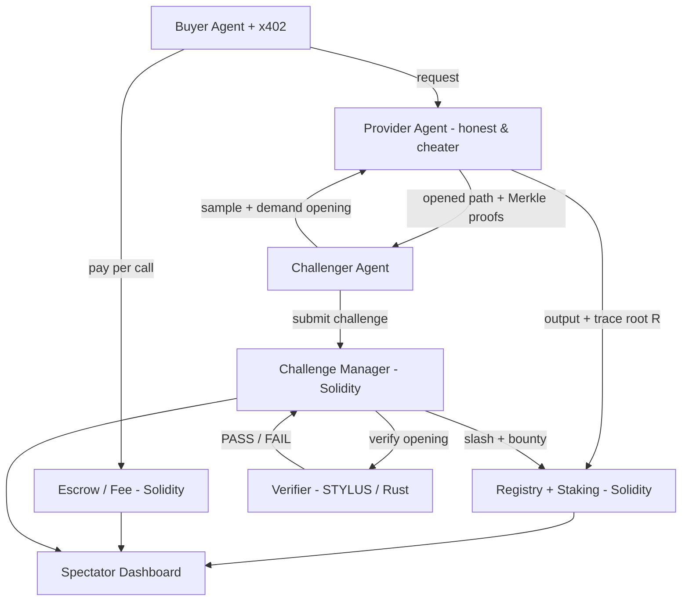

# Proof-of-Model

**A verifiable-inference marketplace for the agent economy, on Arbitrum (Stylus + Solidity).**

When an agent pays a provider for model inference, it can't tell whether it got the model it
paid for — a provider can bill for a frontier model and serve a cheap one (*model substitution*),
or return an output that doesn't match the claimed model+input (*output integrity*). Proof-of-Model
is the missing trust rail: providers **commit to which model they ran** (a Poseidon-Merkle root of
the activation trace), buyers **pay per call via x402**, and challengers **spot-check a random
output→input path and slash provable cheats**. It is Arbitrum's optimistic, sampling-based
fraud-proof paradigm applied to ML inference — *the trust rail, not a compute provider* — with the
heavy verification math in a Stylus contract.

---

## Architecture



**How verification works.** The model is a deterministic `3→8→4→2` fixed-point net (Q-format i64),
its weights committed by hash `H_w`. For each request the provider commits the full activation
trace as a Poseidon-Merkle root `R`. A challenger samples a **random path from a random output
neuron back to the immutable input layer** and demands an opening: each node's activation (proof
against `R`), its weight row + bias (proof against `H_w`), and the full parent-layer activations
(proofs against `R`). The Stylus verifier checks the Merkle proofs and recomputes
`a_j = φ(Σ wᵢⱼ·aᵢ + bⱼ)` in fixed-point at every node on the path, asserting each holds →
PASS/FAIL. A provider serving a cheaper model produces a trace inconsistent with `H_w` along the
path and is caught.

**Why a sampled path — the research basis.** The check walks a *path*, not a single isolated
neuron, by design. A single-neuron check passes vacuously in early layers even when the output is
wrong; anchoring at a random output neuron and walking back to the immutable input is what gives
the test its soundness — to pass while serving a cheap output, a provider would have to produce a
trace consistent with `H_w` along *every* sampled path, i.e. actually run the real model. A single
path bounds detection of a one-node cheat at `~1/N` (`N` = max layer width), so we sample multiple
independent paths to raise it. This follows the verifiable-inference protocol of Anchuri,
Campanelli, Cesaretti, Gennaro, Jois, Kayman & Ozdemir, *"Towards Verifiable AI with Lightweight
Cryptographic Proofs of Inference"* (IEEE SaTML 2026; IACR eprint 2026/541): the path check is the
paper's **`RandPathTest`**, the rejected single-neuron variant its **`RandTestStrawman`**, and
multi-sample (plus interactive bisection, on our roadmap) are its stated routes to tighter
soundness.

| Package | Role |
|---|---|
| `packages/model` | TS reference net — deterministic fixed-point inference, Poseidon-Merkle trace (`R`), weight root (`H_w`), `openPath(ρ)` proof bundles. Source of the golden known-good/known-bad fixtures. |
| `packages/stylus` | Rust/Stylus **Verifier** — Poseidon Merkle-proof verification + per-node fixed-point recompute along the sampled path + assert equality. The deep-engineering core. |
| `packages/contracts` | Solidity — Registry+Staking (ERC-8004-style), ChallengeManager (calls the Verifier), Escrow/Fee. |
| `packages/agents` | Provider (honest + cheat flag), buyer (x402), challenger (sample→open→verify→challenge). |
| `packages/dashboard` | Next.js read-only spectator UI. |
| `packages/shared` | Generated ABIs, deployed addresses, fixed-point + Poseidon params — single source of truth. |
| `scripts/` | Deploy, seed, E2E happy/cheat, `verify.ts` (judge path), demo driver. |

---

## Quickstart

```bash
pnpm install
pnpm build                 # all @proof/* packages
pnpm test                  # TS package tests (golden fixtures asserted everywhere)
pnpm contracts:build       # forge build (Solidity)
pnpm contracts:test        # forge test
pnpm stylus:check          # cargo stylus check (Rust verifier)
```

Run the loop against the live Arbitrum Sepolia deploy:

```bash
pnpm seed                  # register + stake both providers
pnpm e2e:happy             # buyer pays → provider commits R → challenge → PASS → finalize, fee released
pnpm e2e:cheat             # cheat provider commits bad R → challenge → FAIL → slash + bounty
pnpm verify                # one-command judge path: asserts the on-chain slashed state, prints PASS
pnpm demo:driver           # continuous honest cadence + a cheat→slash every 4th cycle (for the dashboard)
```

`pnpm verify` is the judge's 60-second no-video path: it connects to the chain, confirms the
deployed Verifier + Registry bytecode, reads the cheat provider's slashed state, decodes the
`Slashed`/`BountyPaid` events from the challenge receipt, and prints **PASS** with every tx link
(non-zero exit on any failure). It defaults to Sepolia; `--chain one` is wired for the roadmap
Arbitrum One deploy (not live in the MVP — see the honesty table).

---

## Deployed addresses

The MVP ships **live on Arbitrum Sepolia** — Stylus verifier + the full contract stack, with the
honest-PASS and cheat-SLASH paths reproducible on-chain (explorer:
[sepolia.arbiscan.io](https://sepolia.arbiscan.io)).

| Contract | Address |
|---|---|
| Verifier (Stylus) | `0xe19dfd6abae5b0b815dd6b3d8f90126fe68b79ae` |
| Registry + Staking | `0x35198835f689e05bB363f09472360b5D9a44711b` |
| ChallengeManager | `0xc3135c7DbB5EcB87a4F99a538318d968079e96A3` |
| Escrow / Fee | `0x6149f5fB00ec427727e67DD51E7278ED0Bf553cd` |

**Arbitrum One** (roadmap) — the intended production home for the **x402 payment rail** (CDP has no
Sepolia support, so x402 settles on One). Not deployed in the MVP; the migrate is a documented,
single-env flip (`PROOF_CHAIN=one` / `NEXT_PUBLIC_CHAIN=arbitrumOne`) once a funded mainnet
deployer is in place. `ADDRESSES.arbitrumOne` is `null` until then.

Addresses are sourced from `packages/shared/src/addresses.ts` (single source of truth).

**Spectator dashboard:** _Vercel URL pending deploy (`packages/dashboard/DEPLOY.md`)._ Read-only —
optional cosmetic wallet connect, no user actions.

---

## What's live, what's roadmap

The MVP proves the verification *primitive* and the economic game, end-to-end and on-chain.

| Aspect | MVP (shipped) | Roadmap / out of scope |
|---|---|---|
| **Model** | Deterministic `3→8→4→2` fixed-point net. Determinism is *required* for the exact-equality recompute  | Real / non-deterministic LLMs via tolerance-band commitments. |
| **Verification** | Single-round, **multi-sample**: K independent random output→input paths. Per-path detection of a single-node cheat is bounded at `~1/N` (N = max layer width); K paths raise it. The demo is sized so the cheat is caught. | Interactive multi-round **bisection** (the paper's refereed model, App. D) — `O(log N)` rounds to localize the first disputed node. |
| **Challengers** | 1–2 challenger agents. | Large challenger swarm + economic parameter tuning. |
| **Payment rail** | The MVP's demonstrated money spine is the **escrow rail on Sepolia**: it holds the fee, releases to the provider on finalize minus a 5% protocol cut, and **refunds the buyer on a proven slash** — the honest-PASS and cheat-SLASH paths both run end-to-end on-chain. The **x402** buyer→provider rail is wired behind a `PAYMENT_RAIL=x402\|escrow` flag and was proven independently in a Phase-0 spike (live USDC settlement on Arbitrum One). | Running **x402 end-to-end integrated on Arbitrum One** (CDP has no Sepolia support) + a hardened x402 facilitator. The migrate is a single-env flip; it needs a funded mainnet deployer. |
| **x402 no-fee-refund nuance** | When the x402 rail is used it *direct-settles* USDC to the provider, so it has **no fee-refund-on-slash** — there the deterrent is purely the **stake slash + bounty** (which works on either rail), not the fee clawback. The shipped escrow rail adds the buyer refund on top. | — |


---

## Ecosystem benefit

**This is not zkML and not a decentralized-compute marketplace.** We don't re-execute or zk-prove
the whole model, and we don't sell compute. We **commit the trace, spot-check random openings, and
slash provable cheats** — the same optimistic, sampling-based fraud-proof paradigm Arbitrum itself
is built on, applied to inference. We are the **trust rail for paid agent inference, not a compute
provider.**

**Ecosystem benefit.** This directly advances the Arbitrum Foundation's stated "the agent economy
has a verification problem" priority, and gives **x402 + ERC-8004** the missing trust layer for
paid inference — useful to the whole agent-payments ecosystem, not just Arbitrum.

---


