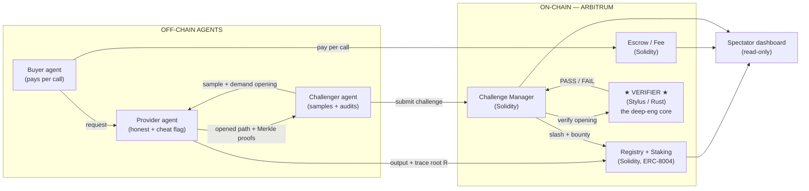

# Proof-of-Model — Pitch Deck Source Doc

*Working doc for building the slide deck. 12 slides. Each slide has: a **headline**
(what goes big on the slide), **body** (the 3–5 words / bullets that appear), and
**say** (your spoken track). Keep one idea per slide — the say-track carries the detail.*

> **Honesty guardrails (baked into this project — keep them on the slides):**
> MVP = deterministic toy net + single-round, multi-sample check. LLMs and interactive
> bisection are roadmap. The money spine shipped on the **escrow rail (Arbitrum Sepolia)**;
> **x402 on Arbitrum One is the production intent**, proven separately in a Phase-0 spike.
> No invented gas multiplier (measured ~2% parity — we ship feasibility, not a headline number).

---

## Slide 1 — Hook

**Headline:**
> When one AI agent pays another to run a model, it has no way to know it got the model it paid for.

**Body (on slide):**
- The agent economy is about to spend a lot on inference.
- It's spending it on trust alone.

**Say:**
"AI agents are starting to pay each other for work — mostly to run models. But when a buyer
agent pays for a frontier model, nothing stops the provider from quietly serving a cheap 7B,
pocketing the difference, and returning a plausible-looking answer. The entire agent economy is
being built on an honor system. We fixed that."

---

## Slide 2 — The Problem

**Headline:**
> Paid agent inference has no proof layer.

**Body (3 pain points):**
- **Model substitution** — bill for a frontier model, serve a cheap one.
- **Output integrity** — return an answer that doesn't match the input + claimed model.
- **No good fix today** — reputation is unprovable; re-running it yourself defeats the point;
  zero-knowledge ML proofs are real but orders of magnitude too slow and expensive per call.

**Say:**
"A buyer gets back an output and a bill — and no way to check either. Today your only options are
to trust a reputation score, re-run the model yourself, or pay for a full cryptographic proof
that costs more than the inference did. None of those scale to millions of agent-to-agent calls."

---

## Slide 3 — The Solution

**Headline:**
> Proof-of-Model is the trust rail for paid agent inference.

**Body (one sentence):**
- Providers **commit to which model they ran**, buyers **pay per call**, and challengers
  **spot-check a random slice of the computation and slash provable cheats.**

**Say:**
"We don't sell compute and we don't prove every call. The provider publishes a tamper-proof
fingerprint of the exact computation it ran. Anyone can cheaply spot-check that fingerprint, and
if it's a lie, the provider's stake gets slashed on-chain. It's Arbitrum's own optimistic
fraud-proof paradigm — the thing that secures the rollup — applied to ML inference."

---

## Slide 4 — How It Works

**Headline:**
> Commit the trace → spot-check a random path → slash the cheat.

**Body (left-to-right flow):**
1. **PAY** — buyer agent pays the provider per call.
2. **COMMIT** — provider runs the model and posts a Poseidon-Merkle root `R` of its full
   activation trace on-chain (weights are fixed and public as `H_w`).
3. **SAMPLE** — a challenger picks a random output neuron and walks a path back to the input layer.
4. **VERIFY** — the on-chain **Stylus verifier** recomputes each node on that path in fixed-point
   and asserts it matches → **PASS / FAIL**.
5. **SETTLE** — PASS: the fee is released (green). FAIL: stake slashed to zero, bounty paid to the
   challenger (red).

**Say:**
"Five steps, all autonomous agents, no human in the loop. The key move is step 4: instead of
re-running the whole network, the verifier checks one random path from an output neuron back to
the immutable input. A provider serving a cheaper model produces a trace that won't match the real
weights somewhere along that path — so it gets caught for the cost of a tiny spot-check."

---

## Slide 5 — Why It Matters / Market

**Headline:**
> The agent economy's bottleneck isn't compute — it's trust.

**Body (one big number + support):**
- **Big number:** _[VERIFY before pitching]_ — e.g. projected agentic-AI / agent-payments market
  size, or "$X spent on inference APIs annually." Pick one stat you can defend on stage and cite it.
- **Support:**
  - Every paid agent-to-agent inference call is an unverified transaction today.
  - Arbitrum Foundation names *"the agent economy has a verification problem"* as a priority.
  - x402 + ERC-8004 give agents identity and payments — but **no trust layer for what was actually run.**

**Say:**
"The picks-and-shovels of the agent economy — payments, identity — are getting built fast. The
missing piece is verification: proof that the work you paid for is the work that happened. That's
a horizontal need across every agent-payments stack, not a niche."

> ⚠️ **TODO:** drop in one real, sourced market number here before the pitch. The project's
> honesty norm means a made-up TAM will hurt you — use a figure you can cite live.

---

## Slide 6 — Architecture

**Headline:**
> Three autonomous agents over an on-chain trust core — with the heavy math in a Stylus contract.

**Body — the system map (build this as boxes-and-arrows on the slide):**

**Callouts to put on the slide:**
- **★ Stylus Verifier (Rust/WASM) — the core.** Verifies Poseidon Merkle proofs + recomputes each
  node on the sampled path in fixed-point. The work the EVM can't do cheaply.
- **Solidity contracts** — Registry + Staking (ERC-8004-style identity/stake), ChallengeManager
  (calls the Verifier, slashes on FAIL), Escrow/Fee (holds payment, releases on finalize).
- **Read-only dashboard** — the human spectates; **no browser transactions, no manual challenge.**
- **`packages/shared`** — fixed-point + Poseidon params are **byte-identical across TS, Rust &
  Solidity** (single source of truth — divergence silently breaks every equality check).
- **Live on Arbitrum Sepolia** — honest-PASS and cheat-SLASH both reproduce on-chain;
  `pnpm verify` reads the chain, decodes the `Slashed`/`BountyPaid` events, prints **PASS**.

**Say:**
"Here's the whole system. Off-chain, three autonomous agents — a buyer that pays, a provider that
serves, and a challenger that audits. On-chain, four contracts on Arbitrum: escrow holds the
payment, the registry holds identity and stake, and the challenge manager runs the optimistic game.
The star is the Verifier — a Rust contract compiled to WASM through Stylus, doing the Merkle-proof
checks and the fixed-point recompute that the EVM can't do cheaply. The human only ever watches a
read-only dashboard — no person can send a protocol transaction, which is what keeps it a real
agent-to-agent system. And it's not a mockup: it's deployed live on Arbitrum Sepolia, with one
command that reads the chain and proves the cheat got slashed. How that spot-check is actually
sound is the next slide."

---

## Slide 7 — The Differentiator (the check that makes it sound)

**Headline:**
> A random path — not a random neuron — is what makes the spot-check sound.

**Body:**
- Anchor at a random **output** neuron, walk back to the immutable **input** layer.
- To pass while serving a cheap model, a provider would have to fake a trace consistent with the
  **real weights along _every_ sampled path** — i.e. actually run the real model.
- One path bounds detection of a one-node cheat at `~1/N`; **multi-sample** raises it.
- Follows Anchuri et al., *"Towards Verifiable AI with Lightweight Cryptographic Proofs of
  Inference"* (IEEE SaTML 2026) — the paper's `RandPathTest`. (We reject its `RandTestStrawman`.)

**Say:**
"Here's the subtle part. Checking a single isolated neuron passes vacuously in early layers even
when the output is wrong — the paper explicitly rejects that. Anchoring at the output and tracing
back to the input is what gives the test its teeth. We implement the paper's accepted protocol,
not the strawman."

---

## Slide 8 — Live Demo / Proof

**Headline:**
> Same committed weights. Two providers. Two outcomes.

**Body:**
- **Provider A — honest:** PASS, keeps the fee. (green)
- **Provider B — cheats on command:** mismatch on a sampled node → **SLASHED**, stake → 0,
  bounty paid. (red)
- Then: `pnpm verify` on the chain → **PASS**. None of it is staged.

**Say:**
"Two providers advertise the *same* model hash. One runs it honestly and keeps earning. The other
swaps in a bad trace — and the challenger catches the mismatch on a single sampled node. Its stake
goes to zero on-chain and the challenger that caught it gets paid. Honesty pays; cheating is
provably unprofitable. Then I run one command that reads the chain and confirms every bit of it."

> *Screen: the spectator dashboard — live event feed, provider cards flipping red, then a terminal
> `pnpm verify` printing PASS with tx links. (See DEMO.md for the beat-by-beat track.)*

---

## Slide 9 — Business Model / The Money Loop

**Headline:**
> Four revenue surfaces — none of them trading.

**Body:**
- **Per-inference fee** — buyer → provider (x402 in production; escrow rail in the MVP).
- **Provider staking** — a slashable bond required to serve.
- **Challenger bounty** — a cut of slashed stake → incentive-compatible policing.
- **Protocol fee** — a small cut of each call = our revenue surface.

**Say:**
"The economics are self-policing. Providers stake to play; challengers earn by catching cheats, so
auditing pays for itself; and we take a small protocol cut of every verified call. The more agent
inference flows through the rail, the more the rail earns — without us ever touching the model or
the compute."

---

## Slide 10 — Positioning (category rejection)

**Headline:**
> Not zkML. Not a compute marketplace. The trust rail.

**Body (3 columns):**
- **zkML** proves every call cryptographically — too slow/expensive per call.
- **Compute marketplaces** sell the inference — they *are* the party you can't trust.
- **Proof-of-Model** commits the trace and spot-checks it — cheap, optimistic, stake-backed.

**Say:**
"Judges and investors will try to file us under zkML or decentralized compute. We're neither. We
don't re-execute or zk-prove the whole model, and we don't sell compute. We make cheating
catchable and expensive — the optimistic, sampling-based approach Arbitrum itself is built on,
applied to inference. We're the verification layer that sits *above* whoever's selling the compute."

---

## Slide 11 — Roadmap (honest scope → scale)

**Headline:**
> The primitive is proven. Here's the path to real models.

**Body (shipped → next):**
| Shipped (MVP) | Next |
|---|---|
| Deterministic `3→8→4→2` fixed-point net | Real / non-deterministic LLMs via **tolerance-band commitments** |
| Single-round, multi-sample path check | Interactive multi-round **bisection** (`O(log N)`, the paper's refereed model) |
| Escrow rail live on Arbitrum Sepolia | **x402 end-to-end on Arbitrum One** (single-env flip; proven in Phase-0 spike) |
| 1–2 challenger agents | Challenger swarm + economic-parameter tuning |

**Say:**
"We deliberately shipped a narrow, deep slice: prove the verification primitive and the economic
game, end-to-end and on-chain. The toy model isn't a weakness — exact-equality recompute *requires*
determinism, and the product is the mechanism, not the model size. The same paradigm scales to real
LLMs with tolerance bands and to multi-round bisection — that's the roadmap, and we're honest about
where the line is today."

---

## Slide 12 — Close / Ask

**Headline:**
> The agent economy needs a proof layer. We built it, and it's running.

**Body:**
- Stylus verifier + full contract stack **live on Arbitrum Sepolia.**
- Advances the Arbitrum Foundation's agent-economy priority; gives x402 + ERC-8004 their missing
  trust layer.
- **The ask:** _[fill in — e.g. judges' vote / grant / design partners / providers to pilot the rail]_

**Say:**
"We built the missing trust rail for paid agent inference — providers commit to the model they ran,
challengers spot-check it, cheaters get slashed — and it's running live on Arbitrum right now,
verifiable with one command. [Then your ask.]"

---

### Appendix — numbers & facts you can defend on stage

- **Live contracts (Arbitrum Sepolia):** Verifier (Stylus) `0xe19dfd…79ae`, Registry+Staking
  `0x351988…711b`, ChallengeManager `0xc3135c…96A3`, Escrow/Fee `0x6149f5…53cd`.
- **Soundness:** single-path detection of a one-node cheat is bounded `~1/N` (N = max layer width);
  multi-sample raises it. Source: Anchuri et al., SaTML 2026 / IACR eprint 2026/541.
- **Gas:** measured **~2% parity** Stylus-vs-Solidity on `verifyPath` — **no headline multiplier
  claimed** (the StarkVerifier "ship the honest 2.1×" lesson). Stylus value here = on-chain
  recompute feasibility.
- **x402 nuance:** x402 direct-settles USDC to the provider, so it has **no fee-refund-on-slash** —
  under x402 the deterrent is the stake slash + bounty. The shipped escrow rail adds a buyer refund
  on top. (Don't overclaim the refund on the x402 slide.)
- **Demo economics** (~30s finalize window, tiny stakes) are a demo window, not production economics.
