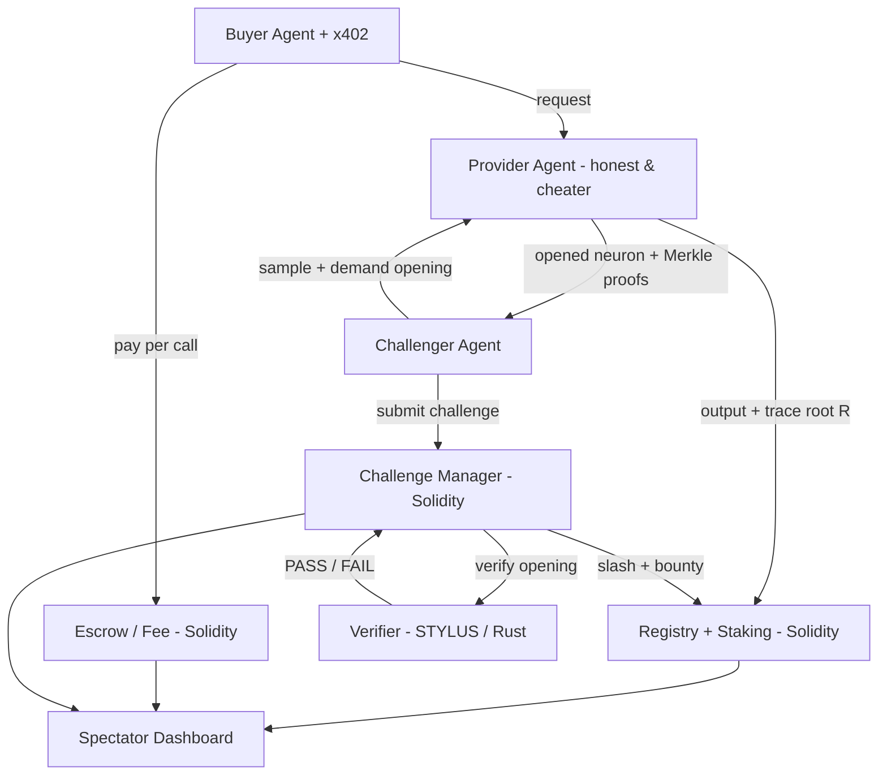

# Proof-of-Model — Project Scope & MVP

*Verifiable-inference marketplace for the agent economy, built on Arbitrum (Stylus + Solidity).*

---

## The one-liner

A marketplace where inference-provider agents **commit to which model they ran**, buyer-agents pay per call (x402), and a swarm of challenger-agents **spot-checks random pieces of the computation and slashes provable cheats** — the same optimistic, sampling-based fraud-proof paradigm Arbitrum itself is built on.

**The bet:** the agent economy has a verification problem (an agent paying a provider for inference can't tell if it got the model it paid for). We build the missing trust rail, with the heavy verification math in a Stylus contract that does what the EVM can't do cheaply.

---

## 1. Problem & trust model

When an agent pays a provider for model inference, it receives an output and a bill (often per-token). It cannot verify:

1. **Model substitution** — that the provider ran the model it claimed (bill for a frontier model, serve a cheap 7B).
2. **Output integrity** — that the output actually corresponds to `input + claimed model + claimed params`.

zk-proving every inference is possible but slow/expensive for real models. **Optimistic verification** is the cheaper paradigm: the provider commits to the *execution trace* of the inference; verification opens only a few randomly sampled positions and checks them; a provable inconsistency slashes a staked bond. Over enough challenges, cheating becomes unprofitable. This is Arbitrum's interactive fraud-proof logic applied to ML inference (cf. Offchain Labs, "Towards Verifiable AI with Lightweight Cryptographic Proofs of Inference," arXiv 2603.19025 — *verify the team's understanding against the live paper before building*).

---

## 2. The verification protocol (the core idea)

Treat an inference as a **deterministic feed-forward computation** over committed weights.

- The model's weights are fixed and committed by hash `H_w` (a known, published model).
- Given an input, every neuron's value is deterministic:
  `a[L][j] = activation( Σ_i w[L][j][i] · a[L-1][i] + b[L][j] )`
- The provider runs the model and builds the **activation trace**: every neuron's value across every layer. It commits to this trace as a Merkle root `R` and returns the output + `R` on-chain.

**The spot-check (a random path — `RandPathTest`, per the paper):** a challenger picks a random *output* neuron and walks a random path back to the immutable input layer, sampling one node per layer (each next node chosen among the parents of the current one). It asks the provider to *open*, for every node `(L, j)` on the path:
- that node's claimed activation `a[L][j]` (Merkle proof against `R`),
- its weight row `w[L][j][*]` and bias (Merkle proofs against `H_w`),
- the **full parent-layer activations** `a[L-1][*]` that feed it (Merkle proofs against `R`).

The on-chain **verifier** verifies the Merkle proofs and runs the **same per-node check** `a[L][j] == φ(Σ_i w[L][j][i]·a[L-1][i] + b[L][j])` in fixed-point at every node on the path, asserting all hold. A path is checkable without recomputing the whole network — gas-cheap and on-chain-feasible. For our `3→8→4→2` net a path is just 3 local checks (output→h2→h1→input).

> **Why a path, not one isolated neuron.** Opening a single random neuron is the paper's `RandTestStrawman`, which it explicitly rejects: discrepancies concentrate in late layers, so an early-layer check passes vacuously even when the output is wrong. Anchoring the check at the output and tracing back to the immutable input is what gives the test its soundness. (The earlier "open one neuron `(L,j)`" framing was a misreading of the paper and has been corrected — see `phase0-paper-review.md`.)

**Soundness (state this honestly):** for a cheat concentrated in a single node, any **single-path** strategy has a detection bound of `~1/N`, where `N` is the maximum layer width (paper, §5/Conclusion). Detection rises with **multiple independent paths**, so soundness scales with the number of sampled paths. The MVP does **single-round, multi-sample** (multi-path) checks sized so the demo cheat is caught; the production fix is **interactive bisection** — the paper's refereed model (Appendix D): two parties bisect a hash-chained trace in `O(log N)` rounds to localize the first disputed node, then check just that node — literally Arbitrum's fraud-proof game. Bisection is roadmap, not MVP.

---

## 3. Why a deterministic small model (and the honesty-table line)

The "recompute each node on the path and assert exact equality" check **requires determinism**. Real LLMs are non-deterministic (floating point, sampling, hardware variance), so they break exact-equality checks. Therefore the MVP uses a **small fixed-point deterministic network** (e.g. `3 → 8 → 4 → 2`), in the lineage of RayStylus's on-chain neural net.

This is a scope choice, not a weakness — the product *is* the verification mechanism and the economic game, not the model size. We will state plainly: **"MVP proves the primitive on a deterministic fixed-point model; non-deterministic LLM support (tolerance-band commitments) is roadmap."** Honesty here reads as credibility (the StarkVerifier lesson: ship the honest 2.1×, not a fictional 18×).

---

## 4. Multi-agent design (human is a spectator)

Three roles, genuine agent-vs-agent dynamics, human watches:

- **Provider agents (≥2):** register an identity (ERC-8004), stake a bond, advertise a model by `H_w`, serve inference, commit traces, serve openings. For the demo, **one provider is honest and one cheats on command** so slashing fires visibly.
- **Buyer / requester agent:** submits requests and pays per call via x402 — generates the demand stream.
- **Challenger / auditor agent(s) (1–2):** independently sample recent requests, demand openings, run the on-chain check, submit challenges, and earn bounties from slashed stake.

**Two competition layers:** providers compete for buyer demand on price + reputation; challengers compete to catch cheaters first for bounties.

**The human watches a live dashboard** — providers, stakes, reputation scores, a feed of requests/payments, and challenges resolving as green **PASS** or red **SLASHED**. No human approves any step; they spectate.

---

## 5. Money loop (explicitly not trading PnL)

- **Per-inference fee** buyer → provider via **x402** (the headline rail; ties to the x402-on-Arbitrum narrative).
- **Provider staking** — a slashable bond required to serve.
- **Challenger bounty** — a share of slashed stake goes to whoever caught the cheat (incentive-compatible policing).
- **Protocol fee** — a small cut of each inference fee = the project's revenue surface.

Four surfaces, none of them trading PnL.

---

## 6. Architecture

**On-chain (Arbitrum Sepolia → One):**
- **Verifier (Stylus / Rust)** — the deep-engineering core. Verifies Merkle proofs + recomputes each node on the sampled output→input path in fixed-point + asserts equality. Returns PASS/FAIL.
- **Registry + Staking (Solidity)** — ERC-8004-style identity, provider registration (`H_w`, stake, reputation), slashing + bounty payout.
- **Challenge Manager (Solidity, calls Verifier)** — the optimistic game: finalize window with no challenge → provider keeps fee; challenge → Verifier checks → slash/bounty resolves.
- **Escrow / Fee (Solidity)** — per-request fee receipts + protocol cut.

**Off-chain:** provider agent service (inference + trace + openings, with a cheat flag); challenger agent service (sample → open → verify → challenge); buyer agent + x402 client; spectator dashboard (frontend).

---

## 7. Why Stylus (the benchmark deliverable)

The verifier's work — Merkle path hashing + a fixed-point dot product per neuron + comparison — is meaningfully cheaper in Rust/WASM than Solidity (StarkVerifier showed ~2.1× on comparable Merkle/hash math). Deliverable: a **Solidity-vs-Stylus gas benchmark table** for the verify function, honest and reproducible. This is what scores "smart contract quality" + "innovation" in the overall track.

---

## 8. The MVP (narrow surface, deep engineering)

**Must demonstrate end-to-end on Arbitrum Sepolia:**

1. One deterministic fixed-point model (`3→8→4→2`), weights committed by `H_w`.
2. Provider registration + staking — **2 providers: 1 honest, 1 cheats on command**.
3. Buyer agent **paying per inference via x402**, producing an on-chain receipt (the "AUDIT paid ORCL $0.10" proof moment).
4. Provider commits trace root `R` + output on-chain.
5. One challenger agent samples a request, demands openings, calls the Stylus verifier.
6. Stylus verifier recomputes the sampled path(s) → honest provider **PASS** (finalize, keeps fee); cheater **FAIL** → **slash + pay challenger bounty**.
7. Spectator dashboard showing it live, with green/red outcomes.
8. One-command on-chain verifier (judge path) + the Stylus-vs-Solidity gas benchmark table.

**Explicitly OUT (honesty-table — state proudly):**
- Real / non-deterministic LLMs → roadmap (tolerance-band commitments).
- Interactive multi-round bisection → roadmap (MVP is single-round, multi-sample).
- Large challenger swarm → 1–2 challengers.
- Hardened x402 facilitator + economic parameter tuning → minimal/testnet for MVP.

---

## 9. Three-week milestones

**Week 1 — contracts + verifier core**
- Days 1–2: read Stylus docs + `cargo-stylus`; scaffold. Build the off-chain reference model that produces deterministic activations + Merkle trace. Pick hash (Keccak = simplest; Poseidon = better Stylus benchmark story).
- Days 3–5: Stylus verifier (Merkle-proof verification + per-node fixed-point recompute along the sampled path + assert) with known-good/known-bad unit tests. Solidity Registry + Staking skeleton. Deploy to Arbitrum Sepolia.

**Week 2 — agents + money loop + challenge game**
- Days 6–8: provider agent service (serve inference, commit root, serve openings; cheat-mode flag). Buyer agent + x402 producing an on-chain receipt. Wire fee escrow.
- Days 9–11: challenger agent (sample → open → verify → challenge). Challenge Manager (finalize window, slash + bounty). Happy path **and** cheat path working on Sepolia with real tx hashes.

**Week 3 — spectator UI + verification deliverable + migrate**
- Days 12–14: dashboard (providers, stakes, reputation, live request/payment feed, challenge outcomes).
- Days 15–17: one-command on-chain verifier (judge path); Stylus-vs-Solidity gas benchmark table; honesty-table + README + category-rejection section.
- Days 18–21: migrate/redeploy to Arbitrum One; record demo (one mechanic per sentence); buffer.

---

## 10. Verification-as-deliverable (the judge path)

Ship a single command (`verify.ts` / CLI) that: connects to Arbitrum Sepolia/One, confirms the deployed Verifier + Registry bytecode, reads the cheating provider's slashed state, fetches the challenge tx receipt, decodes the `SLASHED` event, asserts the bounty was paid, and prints **PASS**. This is simultaneously the product's verifier and the judge's 60-second no-video path.

---

## 11. Category-rejection & ecosystem benefit

**Reject the bucket judges will pattern-match you into:** *"This is not zkML and not a decentralized-compute marketplace. We don't re-execute or zk-prove the whole model — we commit to the trace and spot-check random openings, slashing provable cheats, the same optimistic sampling-based fraud-proof paradigm Arbitrum is built on. We are the trust rail for paid agent inference, not a compute provider."*

**Ecosystem benefit (Arbitrum + industry):** directly advances the Arbitrum Foundation's stated "agent economy has a verification problem" priority, and gives x402 + ERC-8004 the missing trust layer for paid inference — useful to the whole agent-payments ecosystem, not just Arbitrum.

---

## 12. Risks & mitigations

| Risk | Mitigation |
|---|---|
| Determinism breaks exact-equality checks | Fixed-point deterministic model (the reason for the toy model) — baked in. |
| Stylus learning curve / tooling | Budget Week 1; lean on `cargo-stylus`, OpenZeppelin Rust contracts, RayStylus/StarkVerifier as references. |
| x402 maturity/fragility on testnet | Fallback to a minimal on-chain escrow/fee contract; frame x402 as headline, escrow as fallback (honesty-table). Don't let it block the demo. |
| Single-round soundness gap | Be explicit: catch probability scales with samples; size the demo so the cheat is caught; mark interactive bisection as roadmap. Honesty is a strength here. |
| Scope creep ("6 mechanics" trap) | One model, 2 providers, 1 challenger, single-round check. Resist swarms/multi-model/reputation curves until the spine works. |

---

## 13. Open decisions (need your input)

1. **Team's Rust/Stylus comfort** — determines whether the Week-1 verifier timeline is comfortable or tight.
2. **Hash choice** — Keccak (simplest path) vs Poseidon (stronger "heavy math in Stylus" benchmark, more work).
3. **x402 vs escrow for the MVP money loop** — headline x402 with escrow fallback, or escrow-first to de-risk?
4. **Robinhood Chain** — also-deploy there to chase the reserved-slot rule, or keep it Arbitrum Sepolia → One only?
5. **Name** — keep "Proof-of-Model" or brand it sharper.
